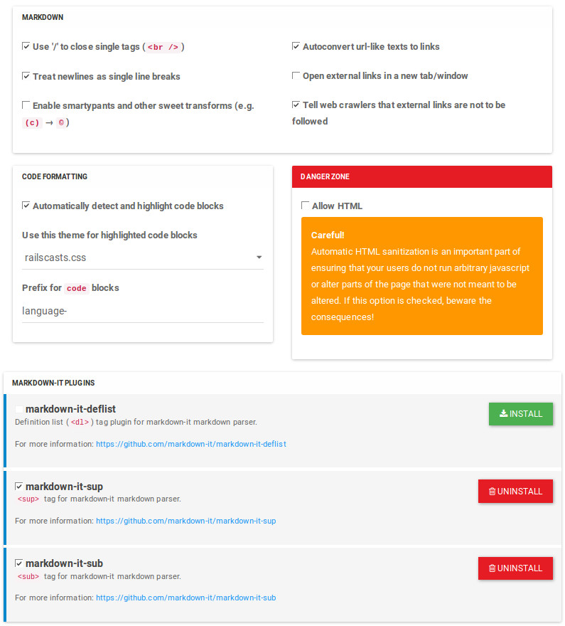

# NodeBB Markdown Parser

This NodeBB plugin is a parser that allows users to write posts using [Markdown](https://daringfireball.net/projects/markdown/).

To customise options for the parser, please consult the "Markdown" page in the administration panel, under the "Plugins" heading.

## Installation

    npm install nodebb-plugin-markdown

## ACP

This plugin can be configured from the ACP, and you can also install or remove markdown-it [plugins](https://www.npmjs.com/browse/keyword/markdown-it-plugin).

